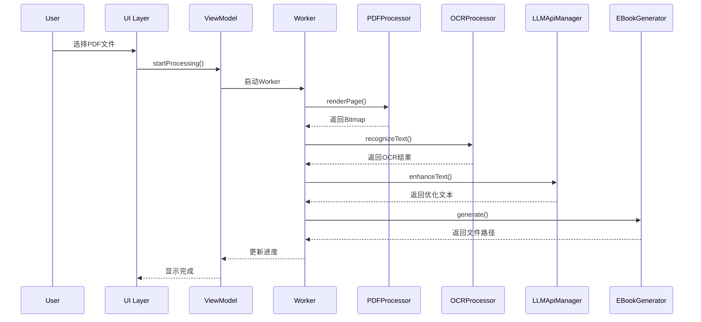
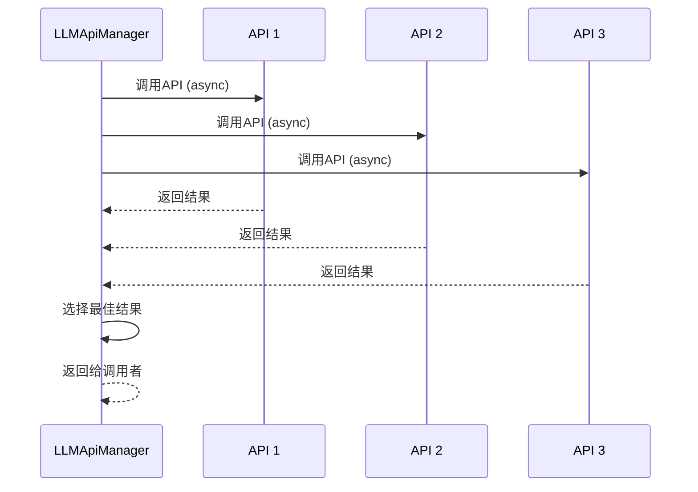

# 开发者文档

面向开发者的技术文档和贡献指南。

## 架构设计

### 整体架构

采用MVVM + Clean Architecture架构模式：

```
┌─────────────────────────────────────────┐
│              UI Layer (Compose)          │
│  ┌──────────┐  ┌──────────┐  ┌────────┐│
│  │  Screen  │  │ViewModel │  │Component││
│  └──────────┘  └──────────┘  └────────┘│
└─────────────────────────────────────────┘
                    ↓
┌─────────────────────────────────────────┐
│           Domain Layer                   │
│  ┌──────────┐  ┌──────────┐  ┌────────┐│
│  │ Use Case │  │  Model   │  │   Repo ││
│  │          │  │          │  │Interface││
│  └──────────┘  └──────────┘  └────────┘│
└─────────────────────────────────────────┘
                    ↓
┌─────────────────────────────────────────┐
│              Data Layer                  │
│  ┌──────────┐  ┌──────────┐  ┌────────┐│
│  │   Room   │  │ Retrofit │  │  Work  ││
│  │ Database │  │   API    │  │Manager ││
│  └──────────┘  └──────────┘  └────────┘│
└─────────────────────────────────────────┘
```

### 模块划分

#### 1. UI层 (ui/)

**职责**：界面展示和用户交互

**组件**：
- `MainScreen`：主屏幕导航
- `HomeScreen`：首页
- `ImportScreen`：PDF导入和设置
- `ProcessingScreen`：处理进度
- `PreviewScreen`：结果预览
- `ExportScreen`：导出选项
- `APIConfigScreen`：API配置
- `SettingsScreen`：应用设置

**技术**：
- Jetpack Compose
- Material Design 3
- Navigation Compose

#### 2. 数据层 (data/)

**职责**：数据持久化和网络通信

**组件**：
- `AppDatabase`：Room数据库
- `APIConfigDao`：API配置数据访问
- `DocumentDao`：文档数据访问
- `PageContentDao`：页面内容数据访问

**技术**：
- Room Database
- Retrofit
- OkHttp

#### 3. 模型层 (model/)

**职责**：定义数据结构

**核心模型**：
- `APIConfig`：API配置模型
- `Document`：文档模型
- `PageContent`：页面内容模型
- `ProcessingSettings`：处理设置模型

#### 4. 网络层 (network/)

**职责**：API调用和管理

**组件**：
- `LLMApiService`：API服务接口
- `LLMApiManager`：API管理器（并行调用）
- `APIClientFactory`：API客户端工厂

**支持的API**：
- OpenAI API
- Anthropic API
- 百度文心一言
- 阿里通义千问
- 其他OpenAI兼容API

#### 5. OCR模块 (ocr/)

**职责**：文字识别

**组件**：
- `OCRProcessor`：OCR处理器

**支持的引擎**：
- Tesseract OCR
- Google ML Kit
- PaddleOCR

#### 6. 图像处理 (utils/)

**职责**：图像处理和优化

**组件**：
- `ImageUtils`：图像工具（水印去除、增强）
- `PDFProcessor`：PDF处理工具
- `EBookGenerator`：电子书生成器

#### 7. 后台任务 (worker/)

**职责**：后台处理任务

**组件**：
- `PDFProcessingWorker`：PDF处理Worker

**技术**：
- WorkManager
- Coroutines

## 核心流程

### PDF处理流程



### API并行调用流程



## 数据流

### 状态管理

使用`StateFlow`进行状态管理：

```kotlin
@HiltViewModel
class HomeViewModel @Inject constructor() : ViewModel() {
    private val _uiState = MutableStateFlow(HomeUiState())
    val uiState: StateFlow<HomeUiState> = _uiState.asStateFlow()
    
    fun updateState(newState: HomeUiState) {
        _uiState.value = newState
    }
}
```

### 数据库操作

使用Room进行数据持久化：

```kotlin
@Dao
interface DocumentDao {
    @Query("SELECT * FROM documents ORDER BY createdAt DESC")
    fun getAllDocuments(): Flow<List<Document>>
    
    @Insert(onConflict = OnConflictStrategy.REPLACE)
    suspend fun insertDocument(document: Document): Long
}
```

### 网络请求

使用Retrofit进行API调用：

```kotlin
interface LLMApiService {
    @POST("chat/completions")
    suspend fun chatCompletions(
        @Body request: ChatRequest
    ): ChatResponse
}
```

## 依赖注入

使用Hilt进行依赖注入：

```kotlin
@HiltViewModel
class HomeViewModel @Inject constructor(
    private val documentDao: DocumentDao,
    private val apiConfigDao: APIConfigDao
) : ViewModel() {
    // ...
}

@Module
@InstallIn(SingletonComponent::class)
object DatabaseModule {
    @Provides
    @Singleton
    fun provideDatabase(
        @ApplicationContext context: Context
    ): AppDatabase {
        return Room.databaseBuilder(
            context,
            AppDatabase::class.java,
            "pdf2ebook_db"
        ).build()
    }
}
```

## 后台任务

使用WorkManager处理耗时任务：

```kotlin
@HiltWorker
class PDFProcessingWorker @AssistedInject constructor(
    @Assisted context: Context,
    @Assisted workerParams: WorkerParameters,
    private val pdfProcessor: PDFProcessor,
    private val ocrProcessor: OCRProcessor
) : CoroutineWorker(context, workerParams) {
    
    override suspend fun doWork(): Result {
        // 处理PDF
        return Result.success()
    }
}
```

启动Worker：

```kotlin
val workRequest = OneTimeWorkRequestBuilder<PDFProcessingWorker>()
    .setInputData(workDataOf(
        "document_id" to documentId,
        "pdf_uri" to pdfUri.toString()
    ))
    .build()

WorkManager.getInstance(context).enqueue(workRequest)
```

## 添加新的API提供商

### 1. 定义API提供商

在`APIProvider.kt`中添加：

```kotlin
enum class APIProvider(val displayName: String, val defaultBaseUrl: String) {
    // ...
    NEW_PROVIDER("新提供商", "https://api.newprovider.com/v1")
}
```

### 2. 定义模型版本

在`ModelVersions.kt`中添加：

```kotlin
val NEW_PROVIDER_VERSIONS = listOf(
    APIVersion("model-1", "模型1", 4096, false, true),
    APIVersion("model-2", "模型2", 8192, true, true)
)
```

### 3. 实现API调用

在`LLMApiManager.kt`中添加：

```kotlin
private suspend fun callNewProviderAPI(
    client: LLMApiService,
    config: APIConfig,
    prompt: String
): String {
    // 实现API调用逻辑
}
```

### 4. 更新路由逻辑

在`callSingleAPI`方法中添加：

```kotlin
return when (config.provider) {
    APIProvider.NEW_PROVIDER -> callNewProviderAPI(client, config, prompt)
    // ...
}
```

## 添加新的OCR引擎

### 1. 定义OCR引擎

在`Document.kt`中添加：

```kotlin
enum class OCREngine {
    TESSERACT,
    MLKIT,
    PADDLEOCR,
    NEW_ENGINE // 新引擎
}
```

### 2. 实现OCR逻辑

在`OCRProcessor.kt`中添加：

```kotlin
private fun initializeNewEngine(language: String): Boolean {
    // 初始化逻辑
}

private fun recognizeWithNewEngine(bitmap: Bitmap): OCRResult {
    // 识别逻辑
}
```

### 3. 更新路由逻辑

```kotlin
suspend fun recognizeText(
    bitmap: Bitmap,
    engine: OCREngine = OCREngine.TESSERACT
): OCRResult = withContext(Dispatchers.IO) {
    when (engine) {
        OCREngine.NEW_ENGINE -> recognizeWithNewEngine(bitmap)
        // ...
    }
}
```

## 添加新的导出格式

### 1. 定义导出格式

在`Document.kt`中添加：

```kotlin
enum class OutputFormat(val extension: String, val mimeType: String) {
    // ...
    NEW_FORMAT("ext", "mime/type")
}
```

### 2. 实现生成逻辑

在`EBookGenerator.kt`中添加：

```kotlin
private fun generateNewFormat(
    document: Document,
    pages: List<PageContent>,
    outputPath: String
): File {
    // 实现生成逻辑
}
```

### 3. 更新路由逻辑

```kotlin
suspend fun generate(
    document: Document,
    pages: List<PageContent>,
    format: OutputFormat,
    outputPath: String
): File? = withContext(Dispatchers.IO) {
    when (format) {
        OutputFormat.NEW_FORMAT -> generateNewFormat(document, pages, outputPath)
        // ...
    }
}
```

## 测试

### 单元测试

```kotlin
@Test
fun testOCRProcessor() = runTest {
    val processor = OCRProcessor(context)
    val result = processor.recognizeText(bitmap)
    assertNotNull(result.text)
}
```

### UI测试

```kotlin
@Test
fun testHomeScreen() {
    composeTestRule.setContent {
        HomeScreen(onImportPDF = {})
    }
    
    composeTestRule
        .onNodeWithText("导入PDF文件")
        .assertIsDisplayed()
}
```

## 性能优化

### 1. 图片优化

- 使用适当的图片采样率
- 及时回收Bitmap
- 使用图片缓存

### 2. 内存优化

- 使用分页加载
- 避免内存泄漏
- 合理使用ViewModel

### 3. 网络优化

- 使用缓存
- 批量请求
- 合理的超时设置

## 贡献指南

### 开发环境

- Android Studio Hedgehog或更高版本
- JDK 17
- Android SDK 34
- Kotlin 1.9.20

### 提交规范

```
feat: 添加新功能
fix: 修复bug
docs: 文档更新
style: 代码格式调整
refactor: 重构
test: 测试相关
chore: 构建/工具相关
```

### Pull Request流程

1. Fork项目
2. 创建特性分支
3. 提交更改
4. 推送到分支
5. 创建Pull Request
6. 等待代码审查

### 代码规范

- 遵循Kotlin官方编码规范
- 使用有意义的变量名
- 添加必要的注释
- 编写单元测试

## 发布流程

### 1. 更新版本号

在`build.gradle`中更新：

```gradle
versionCode 2
versionName "1.1.0"
```

### 2. 生成签名APK

```bash
./gradlew assembleRelease
```

### 3. 创建GitHub Release

- 上传APK文件
- 填写更新日志
- 发布

## 许可证

本项目采用MIT许可证。
